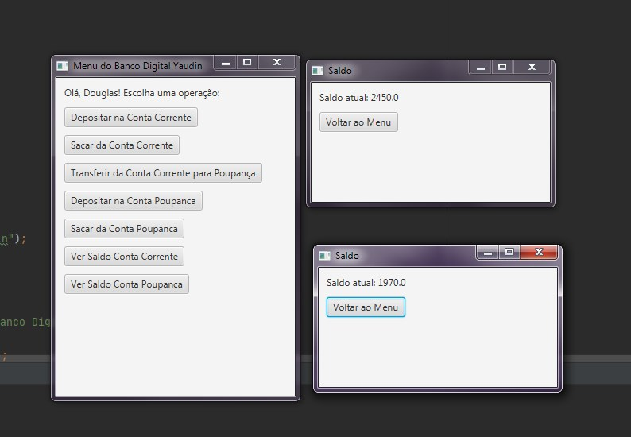

# Banco Digital Yaudin



## Descrição

Considerando nosso conhecimento no domínio bancário, abstraímos uma solução Orientada a Objetos em Java. O cenário é o seguinte: “Um banco oferece aos seus clientes dois tipos de contas (corrente e poupança), com funcionalidades de depósito, saque e transferência (entre contas da própria instituição).”

### Tecnologias Utilizadas
- **Java:** Versão 20
- **JavaFX:** Para a interface gráfica
- **Lombok:** Para reduzir o código boilerplate

## Conceitos de Orientação a Objetos

### Abstração
Nosso projeto concentra-se nos aspectos essenciais do domínio bancário, abstraindo entidades como `Cliente`, `Conta`, `ContaCorrente` e `ContaPoupanca`.

### Encapsulamento
Escondemos a implementação dos objetos, criando interfaces de uso mais concisas e fáceis de entender. Isso facilita a manutenção e evolução do sistema.

### Herança
Utilizamos herança para permitir que `ContaCorrente` e `ContaPoupanca` reutilizem e estendam o comportamento da classe base `Conta`.

### Polimorfismo
Tratamos objetos criados a partir de classes específicas (`ContaCorrente` e `ContaPoupanca`) como objetos de uma classe genérica (`Conta`).

## Estrutura do Projeto

### Classes Principais

#### `Main`
A classe principal que inicia a aplicação JavaFX e configura a interface gráfica.

#### `Banco`
Representa o banco e contém uma lista de contas.

#### `Cliente`
Representa um cliente do banco. Utiliza Lombok para geração automática de getters e setters.

#### `Conta`
Classe abstrata que define métodos comuns para depósitos, saques e transferências.

#### `ContaCorrente`
Extende `Conta` e representa uma conta corrente.

#### `ContaPoupanca`
Extende `Conta` e representa uma conta poupança.

#### `IConta`
Interface que define um contrato para operações em contas.

## Como Executar

1. **Clone o repositório:**
    ```bash
    git clone https://github.com/dlucioyauh/ganhando_produtividade_com_Stream_API_Java.git
    cd ganhando_produtividade_com_Stream_API_Java
    ```

2. **Configure seu ambiente:**
    - Certifique-se de ter o JDK 20 instalado.
    - Adicione as dependências do JavaFX ao seu projeto.

3. **Compile e execute:**
    - Utilize sua IDE favorita (Eclipse, IntelliJ, etc.) ou compile via linha de comando:
    ```bash
    javac -cp "path/to/javafx/lib/*" src/*.java
    java -cp "path/to/javafx/lib/*:src" Main
    ```

## Interface do Usuário

Após iniciar a aplicação, você verá uma tela de boas-vindas onde pode inserir seu nome e iniciar. O menu principal permite realizar operações como depósito, saque, transferência e visualizar saldo.

## Exemplo de Execução

Abaixo está uma imagem de exemplo da interface da aplicação em execução:


---

Sinta-se à vontade para explorar o código e contribuir com melhorias!
